# Generalized Linear Models

In this chapter, we discuss a family of models called *generalized linear models*. These models include ordinary least squares regression, and many others. All[^3] of the models presented in this chapter can be realized as examples of a common framework. We won't present the common framework in this book, but focus on two specific examples - *logistic regression* and *Poisson regression*. We will also return to the more classical framework of regression, where we are interested in the theory and assessing the fit of the model, rather than focussing exclusively on predictive modeling. We will do *a lot* of estimates of regression coefficients for various models in this chapter. I hope that by the time you get to the end of reading it, you will be able to set these up in your sleep.

Since generalized linear models include OLS, let's take a brief review of OLS. Recall that our model is

\[
y = \beta_0 + \sum_{i = 1}^p \beta_i x_i + \epsilon
\]

where $\epsilon$ is normal with mean 0 and unknown variance $\sigma^2$. Another way of thinking about this is that we are modeling the *expected value* of the response via a linear (affine) equation.

\[
E[y] = \beta_0 + \sum_{i = 1}^p \beta_i x_i
\]

and we are assuming that we have *normal errors* or deviations from the expected value. Another way to think about it is that the response $y$ is normal with mean $\mu = \beta_0 + \sum_{i = 1}^p \beta_i x_i$ and variance $\sigma^2$.

## Logistic Regression

Logistic regression is used to model responses that can only be two values. Such variables are called *binary* variables. Examples include determining whether a flipped coin comes up as Heads or Tails, or whether a person recovers or doesn't recover from a disease, or whether a person votes yes or no in an election. Many times, we have additional information that is naturally grouped with the outcome. For example, we may have a persons age, height, weight, the amount and type of medicine they were given in addition to whether they recovered or didn't recover from the disease. The goal is to be able to model the recovery or non-recovery from the disease on the predictors. 

We'll start in the simple case where we have a single predictor and a binary response. Let's have a specific data set in mind so that we can be concrete about things. 


```r
library(tidyverse)
set.seed(4072020)
df <- data.frame(x = rnorm(200, 0, 1.2))
df <- mutate(df, response = rbinom(200, 1, 1/(exp(-1 - 2*x) + 1)))
```

Let's look at some summary statistics.


```r
summary(df)
```

```
##        x                response    
##  Min.   :-3.426106   Min.   :0.000  
##  1st Qu.:-0.707121   1st Qu.:0.000  
##  Median : 0.002425   Median :1.000  
##  Mean   : 0.000774   Mean   :0.605  
##  3rd Qu.: 0.775269   3rd Qu.:1.000  
##  Max.   : 3.420192   Max.   :1.000
```


```r
plot(df$x, df$response)
```

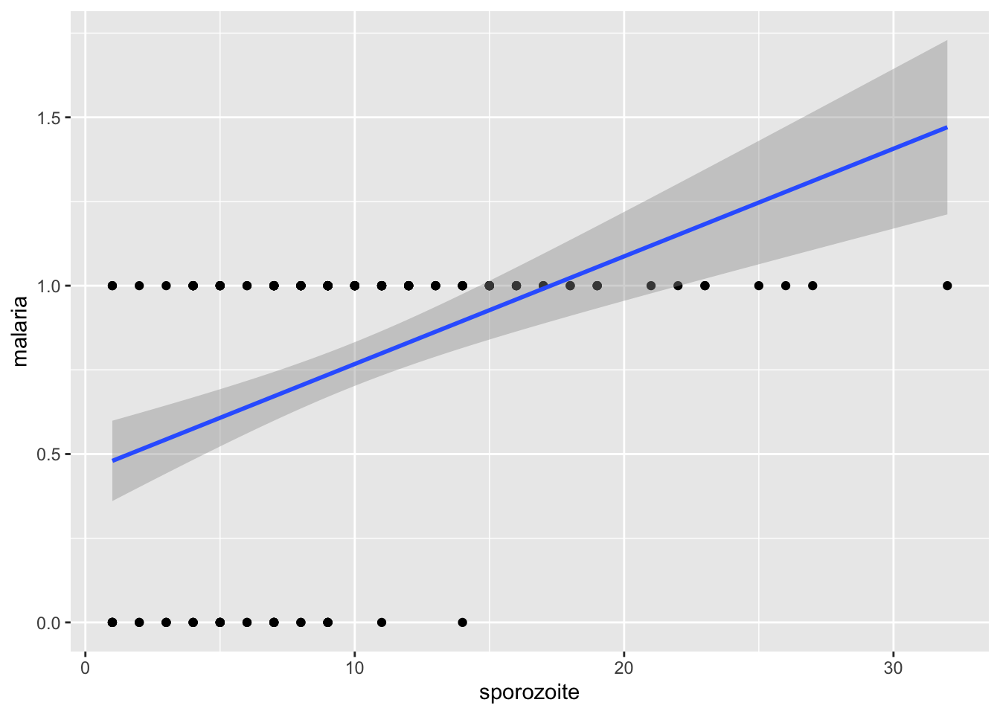

This is a very typical and promising plot for wanting to do logistic regression. We see that as $x$ gets larger, more of the responses are 1 and as $x$ gets smaller, more of the responses are 0. We will see later that this synthetic data was generated **exactly** according to the logistic regression model, much like a response of `1 + 2*x + rnorm(100, 0, 3)` would be exactly according to OLS. 

If we are reasoning analogously to OLS, we might think that we should try to model the *expected value* of the response as a linear (affine) equation of the predictors, as in

\[
E[y] = \beta_0 + \sum_{i = 1}^p \beta_i x_i.
\]

Sometimes that is appropriate, but if we are thinking of the response as a 0/1 random variable, then its expected value is the **probability** of a success. The affine equation above can be negative or bigger than 1, which would be impossible for a probability. Alternatively, let $p = E[y]$, and we could model the **log odds** of the response as an affine equation of the predictors:

\[
\log \frac{p}{1-p} = \beta_0 + \sum_{i = 1}^p \beta_i x_i
\]

This is the approach that is taken in logistic regression. For completeness, let's solve the above equation for $p$:

\[
p = \frac{e^{\beta_0 + \sum_{i = 1}^p \beta_i x_i}}{1 + e^{\beta_0 + \sum_{i = 1}^p \beta_i x_i}} = \frac{1}{1 + e^{-\beta_0 - \sum_{i = 1}^p \beta_i x_i}}
\]

The *error* component in this model is not as easy to see as in the normal case, because it isn't simply added as a random variable. But we can see that the random component of the response is binomial with $n = 1$ and $p = \frac{1}{1 + e^{-\beta_0 - \sum_{i = 1}^p \beta_i x_i}}$. This is is often referred to as "binomial error" or "binomial noise", but the term *random component* makes more sense to me. The predictors can be either continuous or categorical, but we will be going through the derivations only for a single continuous predictor (just like we did with OLS). One final piece of terminology is the *link function*. In the case of logistic regression, the link function is $\log \frac{x}{1-x}$. This is the link between the linear combination of predictors and the expected value of the response.

For the specific example that we are considering, we have only a single predictor $x$, so our model is

\[
\log \frac{p}{1-p} = \beta_0 + \beta_1 x
\]

The first question you might have is: how do we get estimates of $\beta_i$? The classical way is using *maximum likelihood estimation*, which we will get to momentarily. But, if we are coming to this through the lense of what we have covered so far in these notes, which we are, then why not minimize some error function? Let's imagine that we have our values for $\log \frac {p}{1-p}$ in terms of $\beta_0$ and $\beta_1$, so $\log \frac {p_i}{1-p_i} = \beta_0 + \beta_1 x_{1i}$. Ideally, the log odds would be positive and very large when $y_i$ are 1, and would be negative with large absolute value when $y_i$ are 0. Here are three  natural loss functions to minimize, which were taken from [Zhang](https://projecteuclid.org/download/pdf_1/euclid.aos/1079120130). 

**Note** To proceed, we need to transform the response into a $-1/1$ random variable. That is, we change all of the zero responses to $-1$. This just simplifies the notation. We also write $\text{logit}(p_i) = \log \frac {p_i}{1 - p_i}$

The three loss functions are all of the form
\[
\frac{1}n \sum_{i = 1}^n \Phi(\text{logit}(p_i) y_i)
\]

where $\Phi$ is one of

1. $\Phi_1(x) = \max(1-x,0)^2$, *modified least squares*.
2. $\Phi_2(x) = e^{-x}$, *AdaBoost*.
3. $\Phi_3(x) = \log(1 + e^{-x})$, *logistic regression*.

In order to be a good loss function for this model, we would like for *positive values* of $\text{logit}(p_i)y_i$ to be associated with *small* errors. Think about this: if the log odds are bigger than 0, then $p_i > 1 - p_i$, so $p_i > 1/2$. So, if the log odds are bigger than zero and the response is 1, that's a good thing! Similarly if the log odds are less than zero and the response is $-1$, then that's also a good thing! The bigger the value of $\text{logit}(p_i)y_i$, the better it predicts. The smaller the value of $\text{logit}(p_i)y_i$ (i.e., big and negative), the worse it predicts [^1].

We plot the three loss functions so that you can see what the graphs look like.


```r
f <- function(x) {
  pmax(1 - x, 0)^2
}
curve(f, from = -3, to = 2, main = "Comparison of three loss functions") #black
curve(exp(-x), add = T, col = 2) #red
curve(log(1 + exp(-x)), add = T, col = 3) #green
```

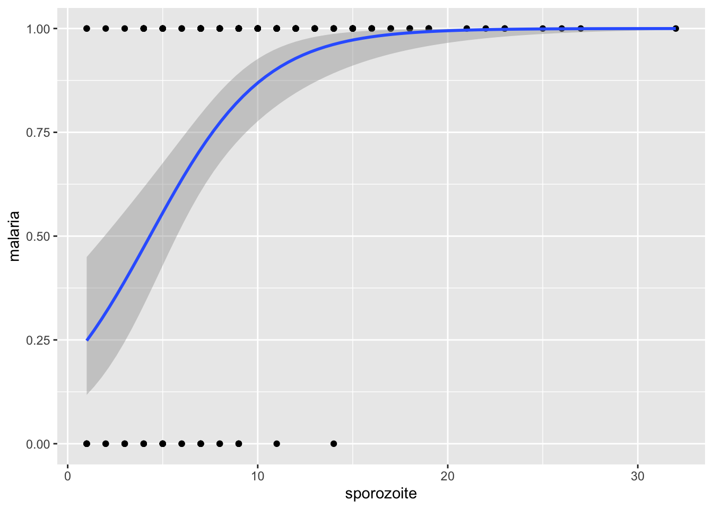

All three functions have varying degrees of penalties for misclassifying the response. *AdaBoost* has an exponential penalty, *modified least squares* has a quadratic penalty, and *logistic regression* has a linear penalty. As usual, this has implications in terms of robustness to outliers and other aspects of the estimates.

OK, let's see how our good friend `optim` can do with these functions! We'll start with the modified least squares, even though that one definitely feels like the hardest because of a lack of differentiability at 1. We first have to get the sse function set up properly.


```r
sse_1 <- function(beta, dat) {
  beta_0 <- beta[1]
  beta_1 <- beta[2]
  mean(f((beta_0 + beta_1*dat$x) * dat$y))
}
names(df) <- c("x", "y")
df <- mutate(df, y = ifelse(y == 0, -1, y))
sse_1(c(0,1), df)
```

```
## [1] 0.606441
```

OK, here we go.


```r
best <- optim(par = c(0,0), fn = sse_1, dat = df)
best
```

```
## $par
## [1] 0.2659848 0.6850055
## 
## $value
## [1] 0.5108565
## 
## $counts
## function gradient 
##       53       NA 
## 
## $convergence
## [1] 0
## 
## $message
## NULL
```

We get values of the parameters to be $\beta_0$ =0.266 and $\beta_1$ = 0.685. Note that these values are not particularly close to the true values that we know: $\beta_0 = 1$ and $\beta_1 = 2$.  

Now, we plot the logistic probability curve on the same graph as the data. We will want to change the responses back to 0/1.


```r
df_zero <- df
df_zero$y <- ifelse(df$y == -1, 0, df$y)
logit <- function(p) {
  log(p/(1-p))
}
inv_logit <- function(y, beta_0, beta_1) {
  1/(1 + exp(-beta_0 - beta_1 * y))
}
beta_0 <- best$par[1]
beta_1 <- best$par[2]
plot(df_zero$x, df_zero$y)
curve(inv_logit(x, beta_0, beta_1), add = T)
```

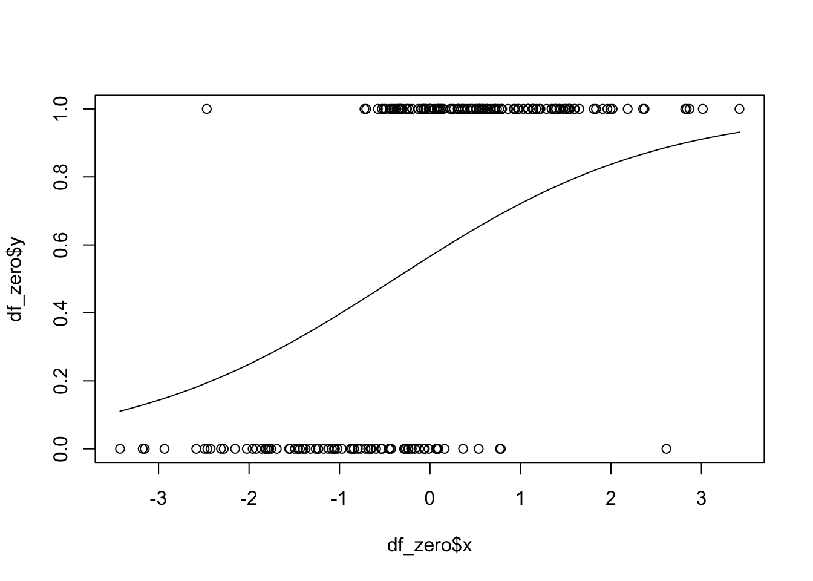

As an exercise, you are asked to repeat the above for the other two loss functions. Before doing so, you should think a bit about what you expect to get, relative to what we got for this one. The graph you are looking to get is below.


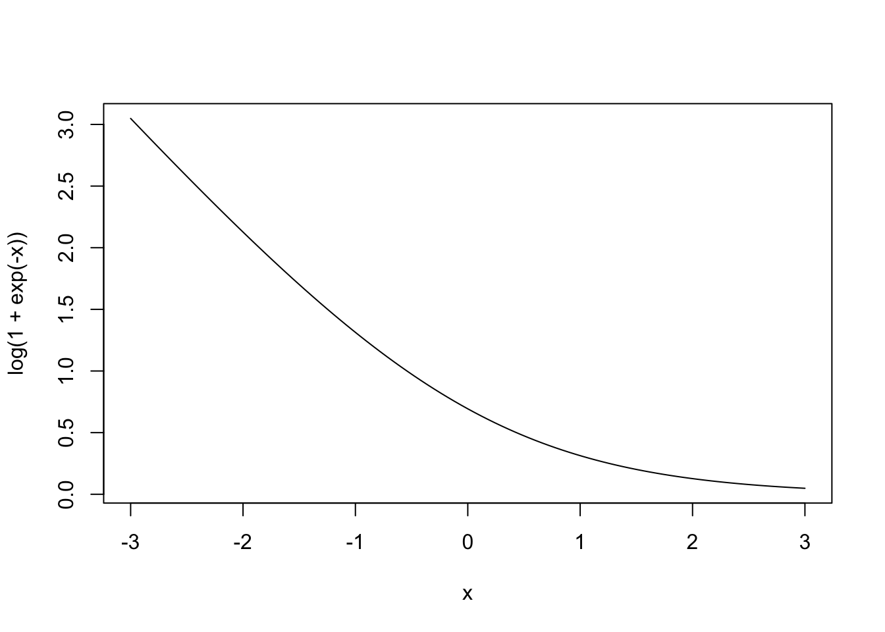

### Maximum Likelihood Estimation

The more traditional way of arriving at the estimates for $\beta_0$ and $\beta_1$ in logistic regression is via **maximum likelihood**. Here, if we have $p_i$ is the probability of success associated with observation $i$, the likelihood of observing $y_i$ would be $p_i^{y_i}(1 - p_i)^{1 - y_i}$. Note that this is a fancy way of writing that the likelihood would be $p_i$ if $y_i = 1$ and it would be $(1 - p_i)$ if $y_i = 0$. The likelihood of observing the sequence $y_1, \ldots, y_n$ would be given by the *product* of the individual likelihoods, since we are assuming independence. Therefore, given $p_i$, the likelihood function is

\[
\Pi_{i = 1}^n p_i^{y_i}(1 - p_i)^{1 - y_i}
\]

A common trick when dealing with likelihood functions is to take the log. We will use below the fact that a positive function $f$ has a maximum at $x = x_0$ if and only if the function $\log f$ has a maximum at $x = x_0$. Taking logs of the likelihood function, we get (after a bit of algebra)

\[
\sum_{i = 1}^n y_i \log(p_i) + (1 - y_i) \log(1 - p_i) = \sum_{\{i: y_i = 1\}} \log(p_i) + \sum_{\{i:y_i = 0\}} \log(1 - p_i)
\]

Finally, we are assuming the following relationship between $p_i$, the $\beta$'s and $x_i$: $p_i = \frac{1}{1 + e^{-\beta_0 - \beta_1 x_i}}$. Therefore, we have the following likelihood that we are trying to maximize:

\[
\sum_{\{i: y_i = 1\}} \log\biggl(\frac{1}{1 + e^{-\beta_0 - \beta_1 x_i}}\biggr) + \sum_{\{i:y_i = 0\}} \log\biggl(1 - \frac{1}{1 + e^{-\beta_0 - \beta_1 x_i}}\biggr)
\]

The sum on the right can be simplified some, but we do not bother. So, that is the function that we want to *maximize* over all choices of $\beta_0$ and $\beta_1$. Let's do it.


```r
log_mle <- function(beta, dat) {
  beta_0 <- beta[1]
  beta_1 <- beta[2]
  p <- inv_logit(dat$x, beta_0, beta_1)
  -1 * sum(dat$y * log(p) + (1 - dat$y) * log(1 - p))
}
optim(par = c(0, 0), fn = log_mle, dat = df_zero)
```

```
## $par
## [1] 0.7783362 2.1695154
## 
## $value
## [1] 76.20191
## 
## $counts
## function gradient 
##       55       NA 
## 
## $convergence
## [1] 0
## 
## $message
## NULL
```

We see that the values for $\beta_0$ and $\beta_1$ that yield the maximum likelihood of the data are approximately the same as the values that we computed above when doing the logistic regression error function.

As an aside, we can also do maximum likelihood estimation in classical OLS. Let's see how it would work for the case of a single numeric predictor. Our model is that 

\[
y_i \sim \text{rnorm}(\beta_0 + \beta_1 x_i, \sigma)
\]

So, the basic model has three parameters in it that we will need to estimate. The likelihood of data $(x_1, y_1), \ldots, (x_n, y_n)$ given parameter values $\beta_0, \beta_1$ and $\sigma$ is given by

\[
L(\text{data}|\text{parameters}) = \Pi_{i = 1}^n \text{dnorm}(y_i, \beta_0 + \beta_1 x_i, \sigma)
\]

Given data, we would maximize the log likelihood function using `optim`.


```r
set.seed(4112020)
ols <- data.frame(x = runif(20, 0, 10))
ols$y <- 1 + 2 * ols$x + rnorm(20, 0, 3)

log_likelihood <- function(params, data) {
  beta_0 <- params[1]
  beta_1 <- params[2]
  sigma <- params[3]
  -1 * sum(log(dnorm(data$y, beta_0 + beta_1 * data$x, sigma)))
}

optim(par = c(0, 0, 1), fn = log_likelihood, data = ols)
```

```
## $par
## [1] 0.4766699 2.0267131 2.6393589
## 
## $value
## [1] 47.78663
## 
## $counts
## function gradient 
##      120       NA 
## 
## $convergence
## [1] 0
## 
## $message
## NULL
```

```r
summary(lm(y ~ x, data = ols))
```

```
## 
## Call:
## lm(formula = y ~ x, data = ols)
## 
## Residuals:
##     Min      1Q  Median      3Q     Max 
## -6.6885 -1.0360  0.0879  1.9647  3.3761 
## 
## Coefficients:
##             Estimate Std. Error t value Pr(>|t|)    
## (Intercept)   0.4771     1.3636   0.350    0.731    
## x             2.0263     0.2119   9.565 1.76e-08 ***
## ---
## Signif. codes:  0 '***' 0.001 '**' 0.01 '*' 0.05 '.' 0.1 ' ' 1
## 
## Residual standard error: 2.782 on 18 degrees of freedom
## Multiple R-squared:  0.8356,	Adjusted R-squared:  0.8265 
## F-statistic: 91.48 on 1 and 18 DF,  p-value: 1.763e-08
```

We see that the maximum likelihood estimators of $\beta_0$ and $\beta_1$ are close to the values from `lm`, but the maximum likelihood estimator of $\sigma$ is different from the residual standard error reported in `lm`. If you run this code multiple times (without setting seed), you will see that this is consistently the case.

Finally, we see how to use the R function `glm` to find the parameters associated with the maximum likelihood/logistic regression error function.


```r
glm(y ~ x, data = df_zero, family = "binomial")
```

```
## 
## Call:  glm(formula = y ~ x, family = "binomial", data = df_zero)
## 
## Coefficients:
## (Intercept)            x  
##      0.7782       2.1698  
## 
## Degrees of Freedom: 199 Total (i.e. Null);  198 Residual
## Null Deviance:	    268.4 
## Residual Deviance: 152.4 	AIC: 156.4
```


### Model Diagnostics

We start by looking at the (residual) deviance. This is twice the difference between the log-likelihood of the *saturated model* and the log-likelihood of the model under consideration. The saturated model has a parameter for each observation, so the estimates will be $\hat p_j = 1$ if $y_j = 1$ and $\hat p_j = 0$ if $y_j = 0$. The likelihood of this data under this set of $\hat p_j$ is exactly 1, so the log-likelihood is zero. Sjoe![^2] That's a long way of saying that the saturated model contributes nothing to the deviance, and we compute the deviance by negative 2 times the log likelihood function of our model, which was computed above.

\[
-2 \sum_j y_j \log \hat p_j + (1 - y_j) \log (1 - \hat p_j)
\]

Generally speaking, the smaller the deviance is, the closer the model under consideration is to the saturated model (which models the data perfectly). Therefore, smaller deviances are preferred to larger ones. Suppose we had another variable in our data set that wasn't related to the response it all. We would expect the deviance of a model with that predictor to be much higher than the deviance with the predictor that we know models the data pretty well, based on how we generated the data.


```r
df_zero$bad <- rnorm(200)
glm(y ~ bad, data = df_zero, family = "binomial")
```

```
## 
## Call:  glm(formula = y ~ bad, family = "binomial", data = df_zero)
## 
## Coefficients:
## (Intercept)          bad  
##      0.4164      -0.1741  
## 
## Degrees of Freedom: 199 Total (i.e. Null);  198 Residual
## Null Deviance:	    268.4 
## Residual Deviance: 267.1 	AIC: 271.1
```

```r
glm(y ~ x, data = df_zero, family = "binomial")
```

```
## 
## Call:  glm(formula = y ~ x, family = "binomial", data = df_zero)
## 
## Coefficients:
## (Intercept)            x  
##      0.7782       2.1698  
## 
## Degrees of Freedom: 199 Total (i.e. Null);  198 Residual
## Null Deviance:	    268.4 
## Residual Deviance: 152.4 	AIC: 156.4
```

Looking under the residual deviance, we see that the model with the variable `bad` is indeed bad, and has residual deviance very close to the null deviance! The null deviance is just the log-likelihood of the data under the model with a single parameter; that is, all $y_j$ are predicted by the same probability $\hat p_j = \hat p$. See that the null and residual deviance are identical in the following model.


```r
glm(y ~ 1, data = df_zero, family = "binomial")
```

```
## 
## Call:  glm(formula = y ~ 1, family = "binomial", data = df_zero)
## 
## Coefficients:
## (Intercept)  
##      0.4263  
## 
## Degrees of Freedom: 199 Total (i.e. Null);  199 Residual
## Null Deviance:	    268.4 
## Residual Deviance: 268.4 	AIC: 270.4
```

We could use the residual deviances of nested models to test whether the variables are necessary for the model, much like we did with ANOVA in regression, but we leave that topic for another book.

In OLS, we examined the residuals in order to get a feel for whether the model's hypotheses are met. In this section, we do a similar thing for logistic regression. We do this for the case of a single predictor, but the ideas are the same for multiple predictors and/or interactions. There are some technicalities that arise in the case of categorical predictors, so we will be assuming a single, numeric predictor, as in our example. The type of residual that we will be dealing with in this section is the *deviance residual* (you don't get confused between breakfast and a fast break, do you? then why should deviance residuals and residual deviances be confusing?). 

\[
d(y_j, \hat p_j) = \begin{cases}-\sqrt{2 |\log(1 - \hat p_j)|} & y_j = 0\\
\sqrt{2 |\log (\hat p_j)|} & y_j = 1
\end{cases}
\]

We will use the deviance residuals to assess the model fit via a **Hosmer Lemeshow** test, which we now describe. 

1. Arrange the data in order based on the fitted values
2. Group the data into 10 groups of roughly equal size.
3. Compute the expected number of successes in each group, together with the observed number of successes in each group.
4. Perform a $\chi^2$ goodness of fit test. The null hypothesis is that the probabilities computed from the model are correct, and the alternative is that they are not. If we reject the null hypothesis, that means that the logistic regression model that we built is not modelling the data well. Note: this is different than saying that it performs poorly on some cross-validation metric. It is saying that the probabilities that we are assigning do not match reality, even for the data that we used to assign those probabilities!

Let's see how to do this step-by-step using R.


```r
# Arrange the data by fitted values

df_zero$bad <- NULL #remove the bad variable
mod <- glm(y ~ x, 
           data = df_zero,
           family = "binomial")
df_zero$fitted_values <- fitted.values(mod)
df_zero$deviance_residuals <- residuals(mod)
df_zero$pearson_residuals <- residuals(mod, type = "pearson")
df_zero <- arrange(df_zero, fitted_values)
mod <- glm(y ~ x, 
           data = df_zero,
           family = "binomial") #We recompute this so that the model matches the current data frame!


# Split into 10 groups of equal size (by fitted value)

df_zero$group <- rep(1:10, each = 20) 
df_zero %>% 
  group_by(group) %>% 
  summarize(count = n(),
            p = mean(fitted_values))
```

```
## # A tibble: 10 × 3
##    group count      p
##    <int> <int>  <dbl>
##  1     1    20 0.0201
##  2     2    20 0.114 
##  3     3    20 0.314 
##  4     4    20 0.493 
##  5     5    20 0.628 
##  6     6    20 0.738 
##  7     7    20 0.853 
##  8     8    20 0.924 
##  9     9    20 0.973 
## 10    10    20 0.993
```

```r
# Compute the expected and observed number of successes

df_zero %>% 
  group_by(group) %>% 
  summarize(expected = sum(fitted_values),
            observed = sum(y))
```

```
## # A tibble: 10 × 3
##    group expected observed
##    <int>    <dbl>    <dbl>
##  1     1    0.401        1
##  2     2    2.28         0
##  3     3    6.28         4
##  4     4    9.86        14
##  5     5   12.6         12
##  6     6   14.8         15
##  7     7   17.1         18
##  8     8   18.5         18
##  9     9   19.5         20
## 10    10   19.9         19
```

Now, for those of you who have used $\chi^2$ tests a lot, you see that we have a problem. The normal rule of thumb is to require the expected number of each cell to be at least 5 or so in order for the test to be run. For this reason, we should probably have used fewer groups, so that the expected values wouldn't be so close to zero. 

Another issue with what we have done so far is that we have arbitrarily only counted the expected successes. We can also count the expected failures and bind it to the bottom.


```r
# Expected and observed number of failures

df_zero %>% 
  group_by(group) %>% 
  summarize(expected = sum(1 - fitted_values),
            observed = sum(1 - y))
```

```
## # A tibble: 10 × 3
##    group expected observed
##    <int>    <dbl>    <dbl>
##  1     1   19.6         19
##  2     2   17.7         20
##  3     3   13.7         16
##  4     4   10.1          6
##  5     5    7.45         8
##  6     6    5.23         5
##  7     7    2.94         2
##  8     8    1.53         2
##  9     9    0.538        0
## 10    10    0.130        1
```

```r
for_chisq <- rbind(
  df_zero %>% 
  group_by(group) %>% 
  summarize(expected = sum(fitted_values),
            observed = sum(y)),
  df_zero %>% 
  group_by(group) %>% 
  summarize(expected = sum(1 - fitted_values),
            observed = sum(1 - y)))
for_chisq
```

```
## # A tibble: 20 × 3
##    group expected observed
##    <int>    <dbl>    <dbl>
##  1     1    0.401        1
##  2     2    2.28         0
##  3     3    6.28         4
##  4     4    9.86        14
##  5     5   12.6         12
##  6     6   14.8         15
##  7     7   17.1         18
##  8     8   18.5         18
##  9     9   19.5         20
## 10    10   19.9         19
## 11     1   19.6         19
## 12     2   17.7         20
## 13     3   13.7         16
## 14     4   10.1          6
## 15     5    7.45         8
## 16     6    5.23         5
## 17     7    2.94         2
## 18     8    1.53         2
## 19     9    0.538        0
## 20    10    0.130        1
```

Now, we perform the $\chi^2$ goodness of fit test on the expected and the observed cell levels. According to Hosmer and Lemeshow, the value of `t_stat` given below should have approximately a $\chi^2$ distribution with 8 degrees of freedom; that is, the number of groups minus 2.


```r
t_stat <- sum((for_chisq$observed - for_chisq$expected)^2/for_chisq$expected)
pchisq(t_stat, 8, lower.tail = F)
```

```
## [1] 0.05708811
```

```r
library(ResourceSelection)
hoslem.test(x = df_zero$y, df_zero$fitted_values, g = 10)
```

```
## 
## 	Hosmer and Lemeshow goodness of fit (GOF) test
## 
## data:  df_zero$y, df_zero$fitted_values
## X-squared = 15.108, df = 8, p-value = 0.05709
```

This $p$-value is not likely to be accurate, since we know that the assumptions of the $\chi^2$ goodness of fit test have not been met. Let's re-run it with $g = 8$, which will likely be closer to meeting the assumptions, though $g = 10$ is certainly the traditional choice.


```r
hoslem.test(x = df_zero$y, df_zero$fitted_values, g = 8)
```

```
## 
## 	Hosmer and Lemeshow goodness of fit (GOF) test
## 
## data:  df_zero$y, df_zero$fitted_values
## X-squared = 9.827, df = 6, p-value = 0.1321
```

We can see some problems with this test of fit. First, we are very likely to have expected cell counts that are close to zero, depending on the data set. This problem will be mitigated somewhat as the number of observations gets larger. A second problem is that we can get different recommendations based on the number of cells that we use. A third problem is that we are not sure what the power of this test is, even if it does meet all of the assumptions. The Hosmer-Lemeshow test for fit is widely used, but for the above reasons, it is not unconditionally recommended. 

One final use of deviance residuals is to see whether there are any high leverage points in our model. We want to examine the deviance residuals and see which ones are abnormally large. It may be worth examining those points to see whether there is anything odd about them. Let's consider our running example. We plot the residuals versus the predictors and versus the predicted values, to see if we have any trends. 


```r
plot(df_zero$x, df_zero$deviance_residuals)
```

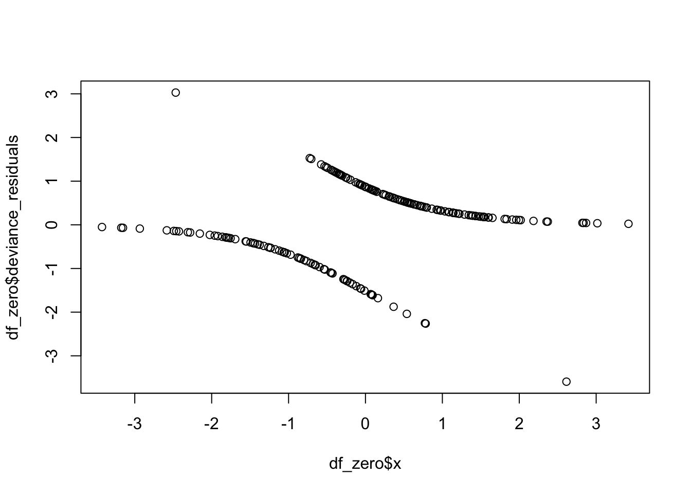

```r
plot(df_zero$fitted_values, df_zero$deviance_residuals)
```

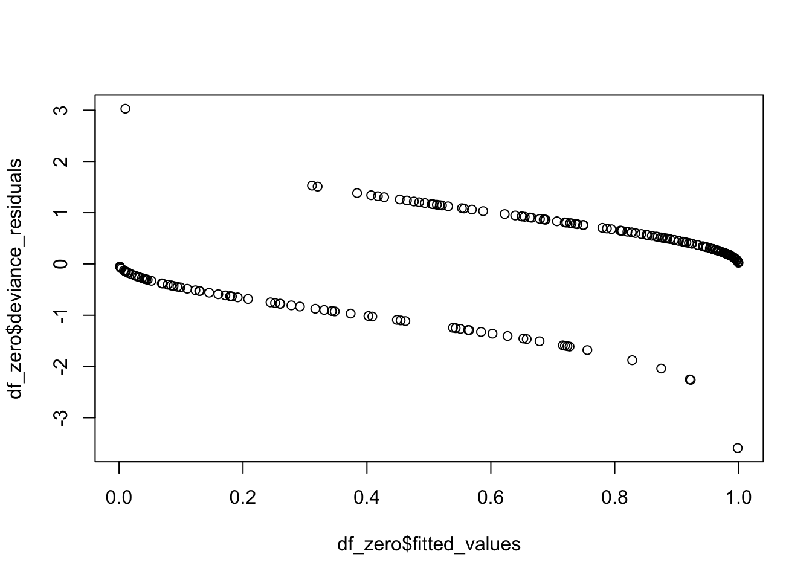

We see that there are two points that seem to have large residuals. Let's examine the two points.


```r
which.max(df_zero$deviance_residuals)
```

```
## [1] 7
```

```r
which.min(df_zero$deviance_residuals)
```

```
## [1] 195
```

```r
df_zero$color <- factor(ifelse(1:200 %in% c(7, 195), 2, 1))
ggplot(df_zero, aes(x, y, color = color)) + geom_point()
```

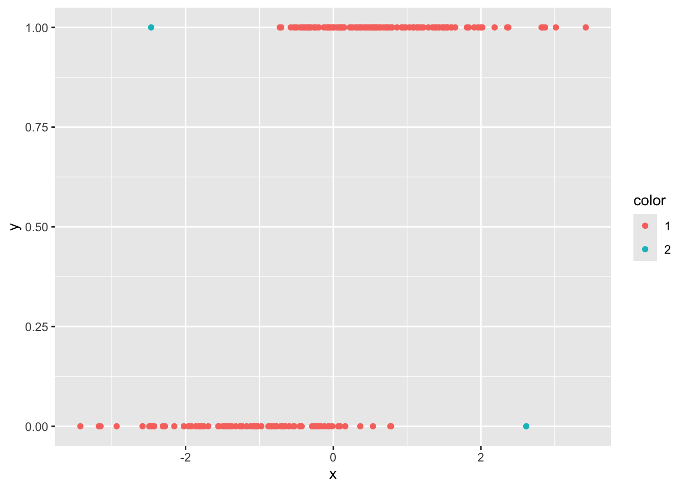

And they are the two points that we would have expected from the plot! We can also pull out the leverage of the points. If we plot them against the predictor, we get a typical looking plot. Note that the leverage tends to be very small where the probability of success is close to zero or one, as well as in the middle. There is usually this bimodal distribution.


```r
plot(df_zero$fitted_values, influence(mod)$hat)
```

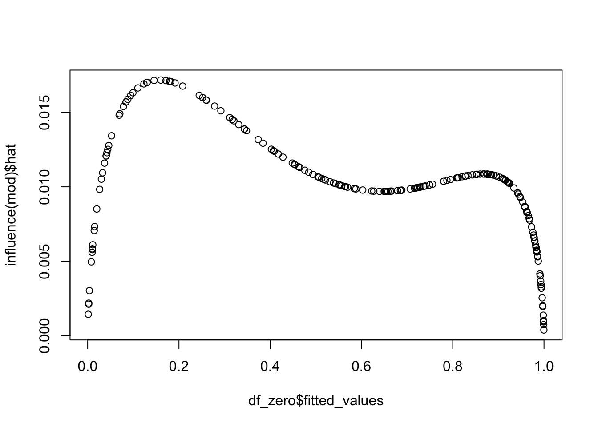

We can see what the most influential point is. 


```r
which.max(influence(mod)$hat)
```

```
## 36 
## 36
```

```r
df_zero$color <- factor(ifelse(1:200 == 36, 2, 1))
ggplot(df_zero, aes(x, y, color = color)) + geom_point() 
```

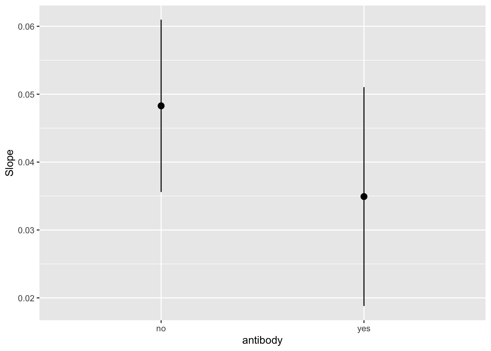

Kind of a surprising value to have the maximum influence! As with OLS, we can find high leverage outliers via the `plot` function. We see that the same two points with highest deviance residuals are the ones that have the most leverage.


```r
plot(mod, which = 5)
```

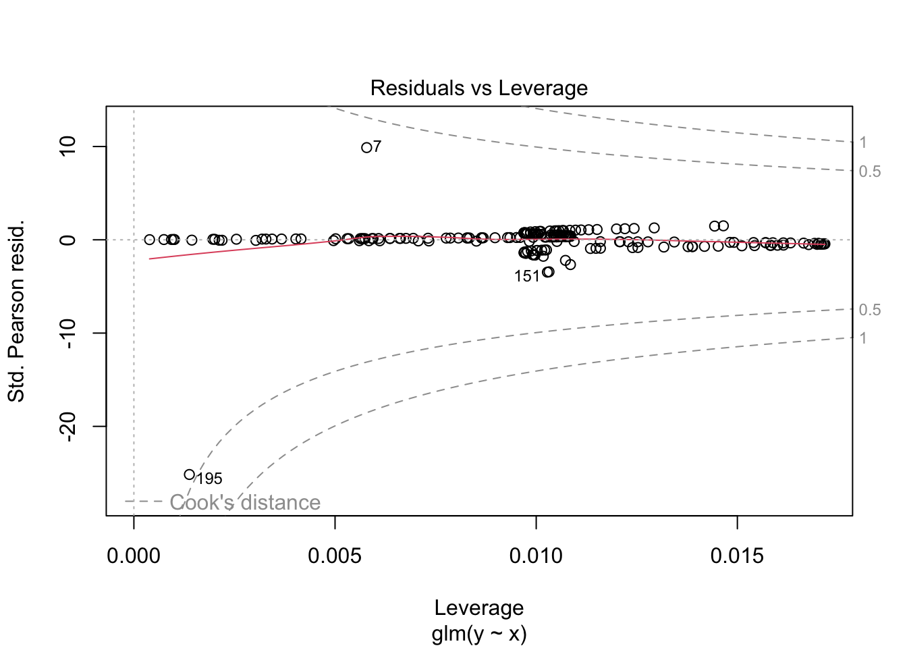

### Case Study

Let's consider a more realistic data set that isn't just simulated data. The `MASS` package contains a data frame called `birthwt`, which is 189 births in the US. We are trying to model low birth weight, which is classified as less than 2.5kg.


```r
bwt <- MASS::birthwt
summary(bwt)
```

```
##       low              age             lwt             race      
##  Min.   :0.0000   Min.   :14.00   Min.   : 80.0   Min.   :1.000  
##  1st Qu.:0.0000   1st Qu.:19.00   1st Qu.:110.0   1st Qu.:1.000  
##  Median :0.0000   Median :23.00   Median :121.0   Median :1.000  
##  Mean   :0.3122   Mean   :23.24   Mean   :129.8   Mean   :1.847  
##  3rd Qu.:1.0000   3rd Qu.:26.00   3rd Qu.:140.0   3rd Qu.:3.000  
##  Max.   :1.0000   Max.   :45.00   Max.   :250.0   Max.   :3.000  
##      smoke             ptl               ht                ui        
##  Min.   :0.0000   Min.   :0.0000   Min.   :0.00000   Min.   :0.0000  
##  1st Qu.:0.0000   1st Qu.:0.0000   1st Qu.:0.00000   1st Qu.:0.0000  
##  Median :0.0000   Median :0.0000   Median :0.00000   Median :0.0000  
##  Mean   :0.3915   Mean   :0.1958   Mean   :0.06349   Mean   :0.1481  
##  3rd Qu.:1.0000   3rd Qu.:0.0000   3rd Qu.:0.00000   3rd Qu.:0.0000  
##  Max.   :1.0000   Max.   :3.0000   Max.   :1.00000   Max.   :1.0000  
##       ftv              bwt      
##  Min.   :0.0000   Min.   : 709  
##  1st Qu.:0.0000   1st Qu.:2414  
##  Median :0.0000   Median :2977  
##  Mean   :0.7937   Mean   :2945  
##  3rd Qu.:1.0000   3rd Qu.:3487  
##  Max.   :6.0000   Max.   :4990
```

While the actual birthweight is available, we are certainly not allowed to use that in our model! Looking at the help page, we make the following changes.


```r
bwt$race <- factor(bwt$race, levels = 1:3, labels = c("white", "black", "other"))
bwt$smoke <- factor(bwt$smoke, levels = 0:1, labels = c("No", "Yes"))
```

We make a coupld of other changes. We change `ftv` to be a simple yes/no did the mother visit a physician in the first trimester. Simlarly, we use whether a woman has had a premature labor as an indicator.


```r
bwt$ftv <- factor(ifelse(bwt$ftv > 0, "Yes", "No"))
bwt$ptl <- factor(ifelse(bwt$ptl > 0, "Yes", "No"))
bwt$ht <- factor(bwt$ht, levels = 0:1, labels = c("No", "Yes"))
bwt$ui <- factor(bwt$ui, labels = c("No", "Yes"))
summary(bwt)
```

```
##       low              age             lwt           race    smoke    
##  Min.   :0.0000   Min.   :14.00   Min.   : 80.0   white:96   No :115  
##  1st Qu.:0.0000   1st Qu.:19.00   1st Qu.:110.0   black:26   Yes: 74  
##  Median :0.0000   Median :23.00   Median :121.0   other:67            
##  Mean   :0.3122   Mean   :23.24   Mean   :129.8                       
##  3rd Qu.:1.0000   3rd Qu.:26.00   3rd Qu.:140.0                       
##  Max.   :1.0000   Max.   :45.00   Max.   :250.0                       
##   ptl        ht        ui       ftv           bwt      
##  No :159   No :177   No :161   No :100   Min.   : 709  
##  Yes: 30   Yes: 12   Yes: 28   Yes: 89   1st Qu.:2414  
##                                          Median :2977  
##                                          Mean   :2945  
##                                          3rd Qu.:3487  
##                                          Max.   :4990
```

Let's build our first model.


```r
mod <- glm(low ~ .-bwt, data = bwt, family = "binomial")
summary(mod)
```

```
## 
## Call:
## glm(formula = low ~ . - bwt, family = "binomial", data = bwt)
## 
## Deviance Residuals: 
##     Min       1Q   Median       3Q      Max  
## -1.6733  -0.8092  -0.5053   0.9681   2.1774  
## 
## Coefficients:
##              Estimate Std. Error z value Pr(>|z|)   
## (Intercept)  0.666501   1.237944   0.538  0.59031   
## age         -0.035441   0.038502  -0.920  0.35731   
## lwt         -0.014907   0.007051  -2.114  0.03450 * 
## raceblack    1.202241   0.533613   2.253  0.02426 * 
## raceother    0.772704   0.459673   1.681  0.09277 . 
## smokeYes     0.814845   0.420334   1.939  0.05255 . 
## ptlYes       1.235554   0.465545   2.654  0.00795 **
## htYes        1.823618   0.705267   2.586  0.00972 **
## uiYes        0.702132   0.464575   1.511  0.13070   
## ftvYes      -0.121458   0.375657  -0.323  0.74645   
## ---
## Signif. codes:  0 '***' 0.001 '**' 0.01 '*' 0.05 '.' 0.1 ' ' 1
## 
## (Dispersion parameter for binomial family taken to be 1)
## 
##     Null deviance: 234.67  on 188  degrees of freedom
## Residual deviance: 196.73  on 179  degrees of freedom
## AIC: 216.73
## 
## Number of Fisher Scoring iterations: 4
```

We see that the residual deviance is lower than the null deviance. We see that, moeroever, the residual deviance is roughly the same as its degree of freedom, so we have no serious reason to question the fit. We now remove some of the variables, using `stepAIC`.


```r
mod_reduced <- MASS::stepAIC(mod, trace = 0)
summary(mod_reduced)
```

```
## 
## Call:
## glm(formula = low ~ lwt + race + smoke + ptl + ht + ui, family = "binomial", 
##     data = bwt)
## 
## Deviance Residuals: 
##     Min       1Q   Median       3Q      Max  
## -1.7308  -0.7841  -0.5144   0.9539   2.1980  
## 
## Coefficients:
##              Estimate Std. Error z value Pr(>|z|)   
## (Intercept) -0.125326   0.967561  -0.130  0.89694   
## lwt         -0.015918   0.006954  -2.289  0.02207 * 
## raceblack    1.300856   0.528484   2.461  0.01384 * 
## raceother    0.854414   0.440907   1.938  0.05264 . 
## smokeYes     0.866582   0.404469   2.143  0.03215 * 
## ptlYes       1.128857   0.450388   2.506  0.01220 * 
## htYes        1.866895   0.707373   2.639  0.00831 **
## uiYes        0.750649   0.458815   1.636  0.10183   
## ---
## Signif. codes:  0 '***' 0.001 '**' 0.01 '*' 0.05 '.' 0.1 ' ' 1
## 
## (Dispersion parameter for binomial family taken to be 1)
## 
##     Null deviance: 234.67  on 188  degrees of freedom
## Residual deviance: 197.85  on 181  degrees of freedom
## AIC: 213.85
## 
## Number of Fisher Scoring iterations: 4
```

Now, let's consider interactions. We start with the variables that we already have as a lower model, then we have as an upper model all interactions, together with age and lwt squared. Note that doing it this way keeps us from getting fitted probabilities of 0/1, which is generally better to avoid. That being said, I am not sure I would have thought to do this! This is how Venables and Ripley did it in their book. I recommend that you run this code below in your own terminal with `trace = 1` so that you can see what models it was considering.


```r
mod2_reduced <- MASS::stepAIC(mod, ~ .^2 + I(scale(age)^2) + I(scale(lwt)^2), trace = 0)
```

Now, we see what percentage of observations in the data set are misclassified.


```r
bwt$fitted_values <- predict(mod2_reduced, type = "response")
bwt$prediction <- ifelse(bwt$fitted_values > 1/2, 1, 0)
mean(bwt$prediction == bwt$low)
```

```
## [1] 0.7513228
```

The plots of residuals versus fitted and leverage don't indicate any problems.


```r
plot(mod2_reduced, which = 5)
```

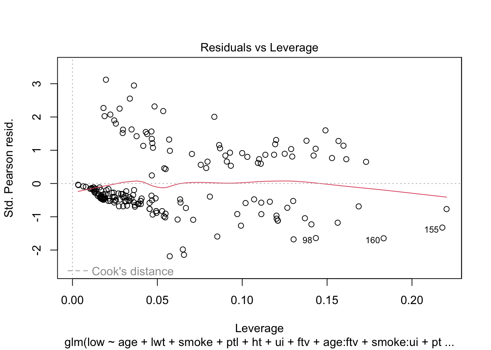

```r
plot(mod2_reduced, which = 1)
```

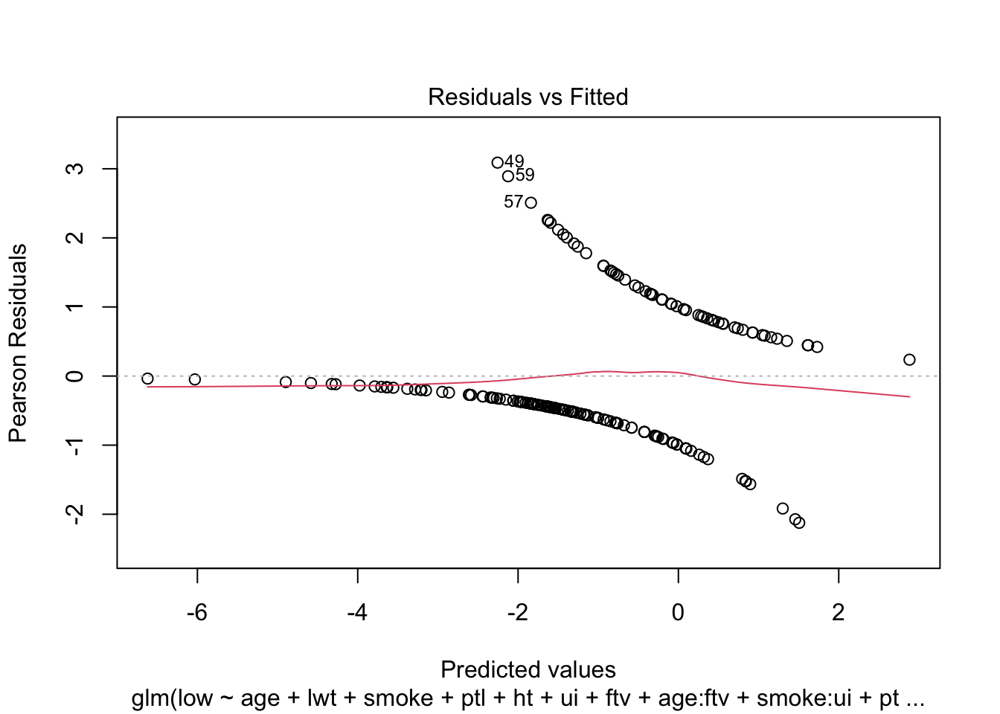

## Count response models

In this section, we discuss models when the response is a count variable. That is, the response is an integer that can at least be interpreted as the count of some number of items. Examples might include the number of days of hospital stays for patients, the number of cigarettes smoked on a given day, or the number of likes that a tweet receives. 

We start by reviewing two distributions that will come up in this section. A random variable $X$ is a *Poisson* with rate $\lambda$ if $X$ is a discrete rv and has probability mass function given by

\[
P(X = x) = e^{-\lambda} \frac{\lambda^x}{x!} \qquad x = 0, 1, \ldots
\]

Recall that we use Poisson rv's to model the number of occurrences in a Poisson process over some time interval, such as the number of accidents at an intersection over a month or the number of typos in one page of typing. For more review, see [here](https://mathstat.slu.edu/~speegle/_book/randomvariables.html#other-special-random-variables). 

Now, we imagine that we have data of the form $({\bf {x}}_1, y_1), \ldots, ({\bf x}_n, y_n)$, where $y_i$ are the responses, and ${\bf x}_i$ are the predictors. We also imagine that the $y_i$ are nonnegative integers, and we suspect that they could be random samples from a Poisson random variable, whose mean $\lambda$ depends on the values of the predictors. We model the relationship between predictors and $\lambda$ as

\[
\log \lambda = \beta_0 + \sum_{i = 1}^P \beta_i x_i
\]

The **random component** of the response is Poisson with $\lambda = e^{\beta_0 + \sum_{i = 1}^P \beta_i x_i}$. The*link function* is $\log x$. This is the link between the linear combination of predictors and the expected value of the response, while the inverse link function is $e^x$. 

Let's set up some simulated data. Note that we are choosing the data to follow precisely a Poisson regression model with one predictor and $\beta_0 = 2$, $\beta_1 = 1$.


```r
x <- runif(100, 0, 2)
y <- rpois(100, lambda = exp(2 + x))
dd <- data.frame(x = x, y = y)
plot(x, y)
```

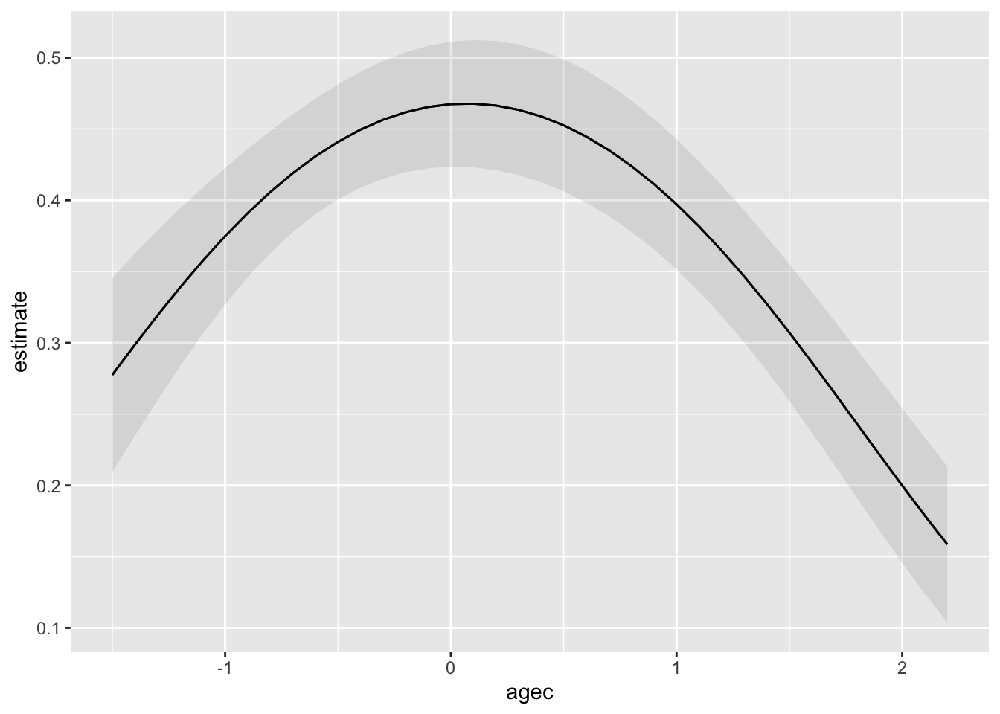

Looking at the plot, we see that the variance of the response depends on the mean of the response! That is because the response is Poisson, and the mean of a Poisson with rate $\lambda$ is $\lambda$, while the standard deviation is $\sqrt{\lambda}$. This is an important observation. In order for a Poisson regression model to be accurate, the mean of the response should also be the variance. From a practical point of view, if you are looking at a graph of data, then the range of values near where the mean of the response is $y_0$ should be about $y_0 \pm 2\sqrt{y_0}$. We will see more detailed ways of checking this assumption later in the chapter.

Next, we want to estimate the parameters of the model. In this case, $\beta_0$ and $\beta_1$. Let's start by minimizing the SSE, like we did in OLS.


```r
sse <- function(beta, dat) {
  sum(abs(dat$y - exp(beta[1] + beta[2] * dat$x))^2)
}
optim(par = c(1, 1), fn = sse, dat = dd)
```

```
## $par
## [1] 1.993814 1.006778
## 
## $value
## [1] 2689.943
## 
## $counts
## function gradient 
##       67       NA 
## 
## $convergence
## [1] 0
## 
## $message
## NULL
```

We see that the estimates of $\beta_0 = 1.9415$ and $\beta_1 = 0.9943$ are pretty accurate! As before, we can modify the error function so that it is more or less sensitive to outliers, say by replacing it with a Huber function or a support vector function. These lead to different estimates for the parameters, which we could chose from based on cross-validation, if we were so inclined. In this chapter, however, we are covering the more classical theory, which uses Maximum Likelihood to estimate the parameters. As we will see, while minimizing SSE can give something pretty close to the maximum likelihood estimators, it is not exactly the same thing.

Recall that the likelihhod function is the product of the likelihood functio of the model, evaluated at the data points. In this case, it is

\[
\Pi\ \text{dpois}(y_i, e^{\beta_0 + \beta_1 x_i})
\]

As before, we will take the log of this so that we don't have issues with overflow. The function that we are maximizing is:

\[
\sum \log \ \text{dpois}(y_i, e^{\beta_0 + \beta_1 x_i})
\]


```r
neg_log_likelihood <- function(beta, dat) {
  -sum(log(dpois(dat$y, exp(beta[1] + beta[2] * dat$x))))
}
optim(par = c(1,1), fn = neg_log_likelihood, dat = dd)
```

```
## $par
## [1] 1.976600 1.018178
## 
## $value
## [1] 293.7288
## 
## $counts
## function gradient 
##       75       NA 
## 
## $convergence
## [1] 0
## 
## $message
## NULL
```

We get very similar estimates for $\beta_0$ and $\beta_1$, but not exactly the same. Let's plot the expected value of $Y$ versus $x$ along with the data.


```r
beta <- optim(par = c(1,1), fn = neg_log_likelihood, dat = dd)$par
plot(x, y)
curve(exp(beta[1] + beta[2] * x), add = T)
```

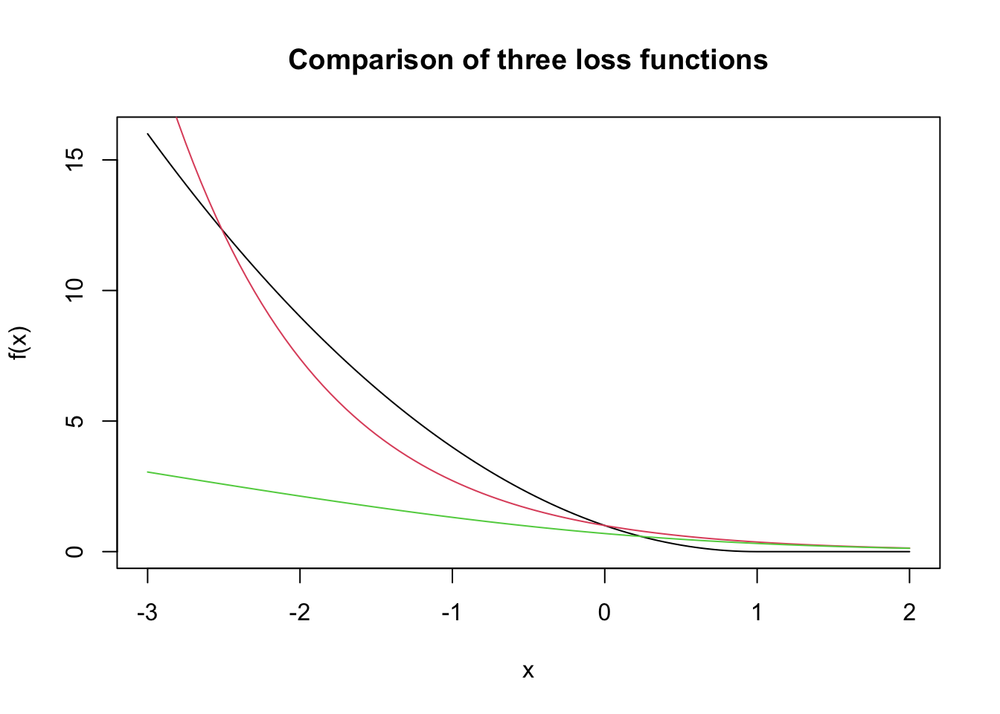

Looks like a pretty good fit to me! 

The built in R way of doing this is to use `glm` with `family = "poisson"`. 


```r
mod <- glm(y ~ x, data = dd, family = "poisson")
summary(mod)
```

```
## 
## Call:
## glm(formula = y ~ x, family = "poisson", data = dd)
## 
## Deviance Residuals: 
##      Min        1Q    Median        3Q       Max  
## -2.35274  -0.72763   0.05344   0.54671   2.40265  
## 
## Coefficients:
##             Estimate Std. Error z value Pr(>|z|)    
## (Intercept)  1.97652    0.05732   34.48   <2e-16 ***
## x            1.01828    0.03913   26.02   <2e-16 ***
## ---
## Signif. codes:  0 '***' 0.001 '**' 0.01 '*' 0.05 '.' 0.1 ' ' 1
## 
## (Dispersion parameter for poisson family taken to be 1)
## 
##     Null deviance: 845.437  on 99  degrees of freedom
## Residual deviance:  98.568  on 98  degrees of freedom
## AIC: 591.46
## 
## Number of Fisher Scoring iterations: 4
```

The residual deviance plays a similar role in Poisson regression to what it played in logistic regression. We see that we have reduced the deviance from the null deviance by quite a large margin, so we are explaining a good deal of the variance through the model. There is one aspect, however, where residual deviance plays an expanded role in Poisson regression. We use it to detect **overdispersion**.

Recall that an important aspect of our model was that we are assuming that the response is Poisson, so the variance of the response should increase with the mean of the response. This is something that we really want to check. The data exhibits overdispersion if the variance is larger than the mean, and underdispersion if the variance is smaller than the mean. Underdispersion is generally less of a problem than overdispersion. 

Let's see how to check overdispersion. We first want to see what the distribution of the residual deviance will be under the null hypothesis. So, we replicate the entire process of sampling data, building a model and computing the residual deviance.


```r
res_dev <- replicate(10000, {
  x <- runif(100, 0, 2)
  y <- rpois(100, lambda = exp(2 + x))
  dd <- data.frame(x = x, y = y)
  mod <- glm(y ~ x, data = dd, family = "poisson")
  deviance(mod) #returns the residual deviance
})
```

Now, let's plot it.


```r
plot(density(res_dev))
```

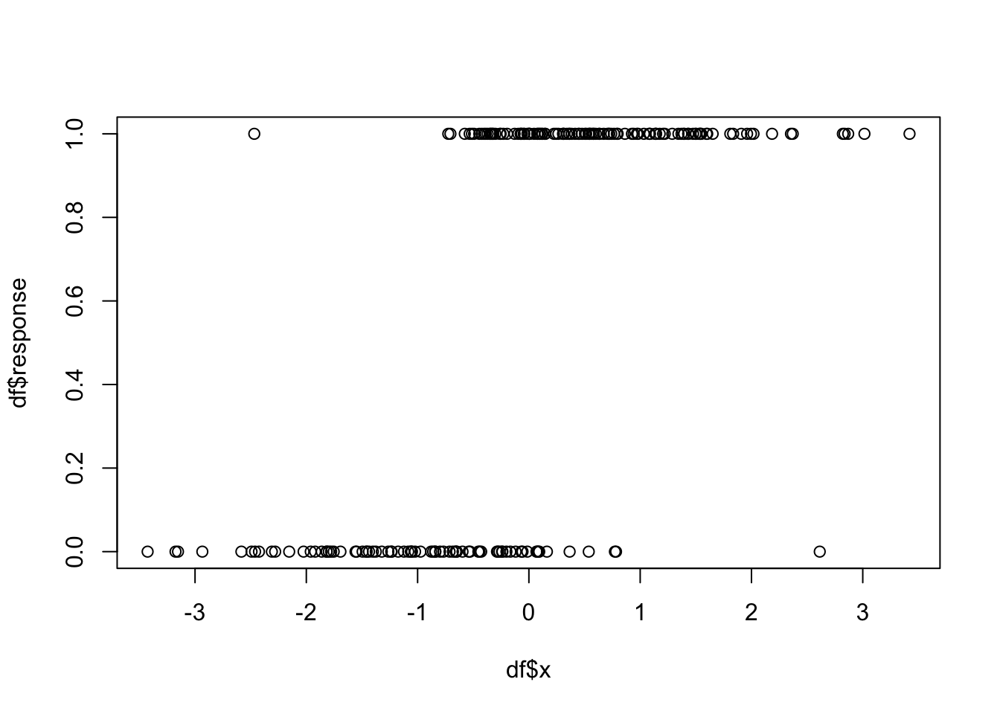

Looks plausibly normal, but probably has some skewness. So let's compare to a $\chi^2$.


```r
plot(density(res_dev))
curve(dchisq(x, df = 98), add = T, col = 2)
```


To test for overdispersion, we would compare the observed residual deviance to a $\chi^2$ with $n - 2$ degrees of freedom. If the result is unlikely, we conclude that the model is not a good fit, at least possibly because of overdispersion.


```r
pchisq(deviance(mod), df = 98, lower.tail = F)
```

```
## [1] 0.4648875
```

For the data that we have here, we would not reject the null hypothesis, and ther is no reason to believe that the model is fitting poorly. Let's look an example that **does** exhibit overdispersion.


```r
set.seed(4212020)
rqpois = function(n, lambda, phi) {
  mu = lambda
  k = mu/phi/(1-1/phi)
  rnbinom(n, mu = mu, size = k)
}
dd <- data.frame(x = runif(100, 0, 2))
dd <- mutate(dd, y = rqpois(100, exp(2 + x), 4))
plot(dd)
```


The overdispersion is not obvious in the plot, but notice that when the mean is about 50, the range of values of the response is about 40, which indicates a standard deviation closer to 10 than to the square root of 50. 


```r
mod <- glm(y ~ x, data = dd, family = "poisson")
summary(mod)
```

```
## 
## Call:
## glm(formula = y ~ x, family = "poisson", data = dd)
## 
## Deviance Residuals: 
##    Min      1Q  Median      3Q     Max  
## -7.117  -1.303  -0.288   1.256   4.749  
## 
## Coefficients:
##             Estimate Std. Error z value Pr(>|z|)    
## (Intercept)  1.92922    0.05533   34.87   <2e-16 ***
## x            1.04647    0.03889   26.91   <2e-16 ***
## ---
## Signif. codes:  0 '***' 0.001 '**' 0.01 '*' 0.05 '.' 0.1 ' ' 1
## 
## (Dispersion parameter for poisson family taken to be 1)
## 
##     Null deviance: 1101.05  on 99  degrees of freedom
## Residual deviance:  318.27  on 98  degrees of freedom
## AIC: 792.56
## 
## Number of Fisher Scoring iterations: 4
```

Note that the residual deviance is quite larger than its degrees of freedom! That is an indicator of overdispersion. We run the test based on the $\chi^2$ statistic:


```r
pchisq(deviance(mod), 98, lower.tail = F)
```

```
## [1] 4.30472e-25
```

We see that we would reject the null hypothesis that the model fits the data. One possible reason for this could be overdispersion, but this is not in and of itself a specific test for overdispersion. The [test](https://www.sciencedirect.com/science/article/abs/pii/030440769090014K) below, based on work by Cameron and Trivedi, is specifically designed to detect overdispersion.

This tests $H_0: \alpha = 0$ versus $H_a: \alpha > 0$ in the model for variance of $\sigma^2 = \mu + \alpha \mu$. 


```r
library(AER)
dispersiontest(mod, trafo = 1)
```

```
## 
## 	Overdispersion test
## 
## data:  mod
## z = 4.1488, p-value = 1.671e-05
## alternative hypothesis: true alpha is greater than 0
## sample estimates:
##    alpha 
## 2.054704
```

We see that we reject the null hypothesis in favor of the alternative, and we estimate that the  relationship between variance and the mean is $\sigma^2 \approx 3\mu$. In particular, Poisson regression is inappropriate for this data set.

**Example** From [Advanced Regression Models with SAS and R](https://www.routledge.com/Advanced-Regression-Models-with-SAS-and-R/Korosteleva/p/book/9781138049017). The number of days of hospital stay was recorded for 45 patients with chest pain, along with their gender, age and history of cardial illness. The data is available [here]


```r
dd <- read.csv("https://mathstat.slu.edu/~speegle/Spring2020/4870/data/Example5.1Data.csv")
```


```
##       days          gender               age          illness         
##  Min.   :0.000   Length:45          Min.   :28.00   Length:45         
##  1st Qu.:1.000   Class :character   1st Qu.:44.00   Class :character  
##  Median :2.000   Mode  :character   Median :52.00   Mode  :character  
##  Mean   :1.956                      Mean   :53.07                     
##  3rd Qu.:3.000                      3rd Qu.:68.00                     
##  Max.   :6.000                      Max.   :77.00
```

We build a model of the number of days in the hospital based on the other variables.


```r
mod <- glm(days ~ ., data = dd, family = "poisson")
summary(mod)
```

```
## 
## Call:
## glm(formula = days ~ ., family = "poisson", data = dd)
## 
## Deviance Residuals: 
##      Min        1Q    Median        3Q       Max  
## -2.23150  -0.67618  -0.02954   0.55535   1.62968  
## 
## Coefficients:
##              Estimate Std. Error z value Pr(>|z|)   
## (Intercept) -0.826269   0.470206  -1.757  0.07888 . 
## genderM      0.226425   0.233142   0.971  0.33145   
## age          0.020469   0.007871   2.600  0.00931 **
## illnessyes   0.447653   0.222305   2.014  0.04404 * 
## ---
## Signif. codes:  0 '***' 0.001 '**' 0.01 '*' 0.05 '.' 0.1 ' ' 1
## 
## (Dispersion parameter for poisson family taken to be 1)
## 
##     Null deviance: 54.421  on 44  degrees of freedom
## Residual deviance: 36.654  on 41  degrees of freedom
## AIC: 144.43
## 
## Number of Fisher Scoring iterations: 5
```

We see that the data is perhaps *underdispersed*, that is, the variance is less than the mean. This isn't as big of a problem as overdispersion, at least at this level of underdispersion. In general, though, we would want to make sure that we are modeling things correctly. I have seen underdispersion that was explained by **zero inflation**, especially when most of the responses are small anyway. Zero-inflation is when the response is Poisson, except for the fact that there are too many zeros. In general, there are just a lot of things to check when modeling count data!

We can do variable selection via AIC, using the `stepAIC` function from `MASS`.


```r
mod_final <- MASS::stepAIC(mod)
```

```
## Start:  AIC=144.43
## days ~ gender + age + illness
## 
##           Df Deviance    AIC
## - gender   1   37.623 143.40
## <none>         36.654 144.43
## - illness  1   40.719 146.49
## - age      1   43.828 149.60
## 
## Step:  AIC=143.4
## days ~ age + illness
## 
##           Df Deviance    AIC
## <none>         37.623 143.40
## - illness  1   41.945 145.72
## - age      1   45.596 149.37
```

We see that gender is removed, and that we predict the days in hospital based on previous illness of the patient and the age of the patient. We estimate the mean length of stay for patients who are age 50 with previous illness to be


```r
coef(mod_final)
```

```
## (Intercept)         age  illnessyes 
## -0.72142577  0.02111739  0.46362688
```


\[
\log \lambda = -0.72142577 + 0.02111739 \times 50 + 0.46362688 
\]

so $\lambda = 2.221251. We can also get this via


```r
predict(mod_final, newdata = data.frame(age = 50, illness = "yes"), type = "response")
```

```
##        1 
## 2.221252
```

### Overdispersion

Let's consider the `quine` data set from `MASS`. This is a typical example of an overdispersed data set. We are modeling the days absent from school for students based on several predictor variables.


```r
qq <- MASS::quine
summary(qq)
```

```
##  Eth    Sex    Age     Lrn          Days      
##  A:69   F:80   F0:27   AL:83   Min.   : 0.00  
##  N:77   M:66   F1:46   SL:63   1st Qu.: 5.00  
##                F2:40           Median :11.00  
##                F3:33           Mean   :16.46  
##                                3rd Qu.:22.75  
##                                Max.   :81.00
```

If we run a Poisson regression, we get:


```r
mod <- glm(Days ~ ., data = qq, family = "poisson")
summary(mod)
```

```
## 
## Call:
## glm(formula = Days ~ ., family = "poisson", data = qq)
## 
## Deviance Residuals: 
##    Min      1Q  Median      3Q     Max  
## -6.808  -3.065  -1.119   1.819   9.909  
## 
## Coefficients:
##             Estimate Std. Error z value Pr(>|z|)    
## (Intercept)  2.71538    0.06468  41.980  < 2e-16 ***
## EthN        -0.53360    0.04188 -12.740  < 2e-16 ***
## SexM         0.16160    0.04253   3.799 0.000145 ***
## AgeF1       -0.33390    0.07009  -4.764 1.90e-06 ***
## AgeF2        0.25783    0.06242   4.131 3.62e-05 ***
## AgeF3        0.42769    0.06769   6.319 2.64e-10 ***
## LrnSL        0.34894    0.05204   6.705 2.02e-11 ***
## ---
## Signif. codes:  0 '***' 0.001 '**' 0.01 '*' 0.05 '.' 0.1 ' ' 1
## 
## (Dispersion parameter for poisson family taken to be 1)
## 
##     Null deviance: 2073.5  on 145  degrees of freedom
## Residual deviance: 1696.7  on 139  degrees of freedom
## AIC: 2299.2
## 
## Number of Fisher Scoring iterations: 5
```

At a first glance, it appears that all of the variables are significant with very low $p$-values. However, note that the residual deviance is considerably larger than its degrees of freedom, which is an indicator for overdispersion. This should cause us to seriously doubt the accuracy of the $p$-values.

There are a couple of options for modeling with overdisperion, including *quasipoisson* regression and *negative binomial* regression. For now, we use quaispoisson, which adds a parameter that attempts to deal with the overdispersion. 


```r
mod_quasi <- glm(Days ~ ., data = qq, family = "quasipoisson")
summary(mod_quasi)
```

```
## 
## Call:
## glm(formula = Days ~ ., family = "quasipoisson", data = qq)
## 
## Deviance Residuals: 
##    Min      1Q  Median      3Q     Max  
## -6.808  -3.065  -1.119   1.819   9.909  
## 
## Coefficients:
##             Estimate Std. Error t value Pr(>|t|)    
## (Intercept)   2.7154     0.2347  11.569  < 2e-16 ***
## EthN         -0.5336     0.1520  -3.511 0.000602 ***
## SexM          0.1616     0.1543   1.047 0.296914    
## AgeF1        -0.3339     0.2543  -1.313 0.191413    
## AgeF2         0.2578     0.2265   1.138 0.256938    
## AgeF3         0.4277     0.2456   1.741 0.083831 .  
## LrnSL         0.3489     0.1888   1.848 0.066760 .  
## ---
## Signif. codes:  0 '***' 0.001 '**' 0.01 '*' 0.05 '.' 0.1 ' ' 1
## 
## (Dispersion parameter for quasipoisson family taken to be 13.16691)
## 
##     Null deviance: 2073.5  on 145  degrees of freedom
## Residual deviance: 1696.7  on 139  degrees of freedom
## AIC: NA
## 
## Number of Fisher Scoring iterations: 5
```

There is a significant difference in $p$-values between this model and the previous, and we would draw very different conclusions about what variables are significant for modeling days absent. The quasipoisson model is preferred over the Poisson model in this case. 

### Negative Binomial Regression

One downside of using quasipoisson is that AIC is not defined for the quasiPoisson model. If we wish to use AIC for variable selection, then we can use *negative binomial* regression instead. Let's look at some details. First, we recall that a negative binomial random variable counts the number of failures before the $k$th success in a series of Bernoulli trials, each with probability of success $p$. It has probability mass function given by

\[
P(X = x) = {{x + k -1}\choose {k-1}}p^k(1 - p)^{x - k}, \qquad x = 0, 1, 2, \ldots
\]

Another realization of a negative binomial with parameters $k$ and $p$ is that it is the sum of $k$ independent geometric rvs. In particular, the mean of $X$ will be $\mu = k \frac{1-p}{p}$ and the variance will be $\sigma^2 = k \frac{1-p}{p^2}$. In particular, since $1/p^2 > 1/p$, negative binomial rvs have variances **larger than** their means. For this reason, they are often suggested for modeling count responses that are overdispersed relative to a Poisson response.

Moving away from our intuition of number of trials until the $k$th success, we can formally replace the factorials in ${{x + k -1}\choose {k-1}}$ with gamma functions, and then $k$ can be any positive integer! In this case, we have the probability mass function is given by

\[
P(X = x) = \frac{\Gamma(x + k)}{\Gamma(k) x!} p^k(1 - p)^{x - k}, \qquad x = 0, 1, 2, \ldots
\]

While this may defy straightforward interpretation in terms of Bernoulli trials, having the additional flexibility to choose $k$ to be non-integral will be useful when modeling. 

An alternative parameterization that yields the same family of random variables is by the *mean* parameter $\mu$ and the *dispersion* parameter, given by `size`. The variance in this parameterization is $\sigma^2 = \mu + \mu^2/{\text{size}}$. We can go from the mean/dispersion parameterization to the one given above by letting $p = {\text{size}/({\text{size} + \mu)$ and $k = {\text{size}$. Let's check it with some R.


```r
mu <- 10
size <- 4
k <- size
p <- size/(size + mu)
dnbinom(1:10, size = size, prob = p)
```

```
##  [1] 0.01903969 0.03399944 0.04857063 0.06071328 0.06938661 0.07434280
##  [7] 0.07586000 0.07450535 0.07095748 0.06588909
```

```r
dnbinom(1:10, size = size, mu = mu)
```

```
##  [1] 0.01903969 0.03399944 0.04857063 0.06071328 0.06938661 0.07434280
##  [7] 0.07586000 0.07450535 0.07095748 0.06588909
```

With the mean-dispersion parameterization, we can see that the variance can be any value that is larger than the mean. This allows quite a bit of fliexibility for modeling overdispersed count processes. 

Now, suppose we have data $(x_1, y_1), \ldots, (x_n, y_n)$ and we believe that the expected value of the response $Y$ given $x$ is modeled by
\[
\log E[Y|X = x] = \beta_0 + \beta_1 x
\]
then we would have 
\[
\log \mu = \beta_0 + \beta_1 x
\]
The inverse link function is $\mu = e^{\beta_0 + \beta_1 x}$, and the random component of the model is negative binomial.

Let's create some simulated data.


```r
set.seed(4282020)
dd <- data.frame(x = runif(100, 0, 10))
dd <- mutate(dd, y = rnbinom(100, size = runif(1, 3, 10), mu = exp(1 + .2 * x)))
plot(dd)
```


Recall that if this were Poisson, then the range would be roughly the expected value $y_0 \pm 2\sqrt{y_0}$, which is not correct. When $x \approx 10$, $y \approx 15$, but the range is bigger than $15 \pm 8$. Let's set up the likelihood function for the model. There are three parameters in the model, $\beta_0, \beta_1$ and the size parameter, which estimates the amount of overdispersion.

\[
\Pi \ {\text{dnbinom}}(y_i, mu = e^{\beta_0 + \beta_1 x_i}, size = k)
\]

Let's maximize the log likelihood.


```r
neg_log_likelihood <- function(par, dat) {
  -1 * sum(log(dnbinom(dat$y, mu = exp(par[1] + par[2] * dat$x), size = par[3])))
}

optim(par = c(0,0,1), fn = neg_log_likelihood, dat = dd)$par
```

```
## [1] 0.9586144 0.2090342 3.5983988
```

We get an estimate of $\beta_0 = 0.9586, \beta_1 = 0.209$ and dispersion parameter of 3.598. That's close to the true values of $1, 2$ and unknown. Let's run the analysis using `MASS:glm.nb`.


```r
mod <- MASS::glm.nb(y ~ ., data = dd)
summary(mod)
```

```
## 
## Call:
## MASS::glm.nb(formula = y ~ ., data = dd, init.theta = 3.598485478, 
##     link = log)
## 
## Deviance Residuals: 
##     Min       1Q   Median       3Q      Max  
## -3.3974  -0.8392  -0.1058   0.6026   1.7356  
## 
## Coefficients:
##             Estimate Std. Error z value Pr(>|z|)    
## (Intercept)  0.95853    0.13877   6.907 4.95e-12 ***
## x            0.20905    0.02093   9.989  < 2e-16 ***
## ---
## Signif. codes:  0 '***' 0.001 '**' 0.01 '*' 0.05 '.' 0.1 ' ' 1
## 
## (Dispersion parameter for Negative Binomial(3.5985) family taken to be 1)
## 
##     Null deviance: 210.32  on 99  degrees of freedom
## Residual deviance: 109.87  on 98  degrees of freedom
## AIC: 591.29
## 
## Number of Fisher Scoring iterations: 1
## 
## 
##               Theta:  3.598 
##           Std. Err.:  0.784 
## 
##  2 x log-likelihood:  -585.286
```

`MASS::stapAIC` also works with models built with `glm.nb`, so we can do variable selection using AIC when we have a larger collection of variables. Let's look at the `quine` data set.


```r
quine <- MASS::quine
mod <- MASS::glm.nb(Days ~ ., data = quine)
mod_final <- MASS::stepAIC(mod, trace = 0)
summary(mod_final)
```

```
## 
## Call:
## MASS::glm.nb(formula = Days ~ Eth + Age + Lrn, data = quine, 
##     init.theta = 1.271992937, link = log)
## 
## Deviance Residuals: 
##     Min       1Q   Median       3Q      Max  
## -2.8081  -0.8820  -0.2790   0.3977   2.2727  
## 
## Coefficients:
##             Estimate Std. Error z value Pr(>|z|)    
## (Intercept)   2.9351     0.2017  14.551  < 2e-16 ***
## EthN         -0.5627     0.1535  -3.667 0.000246 ***
## AgeF1        -0.4703     0.2363  -1.990 0.046590 *  
## AgeF2         0.1009     0.2363   0.427 0.669391    
## AgeF3         0.3591     0.2452   1.465 0.142999    
## LrnSL         0.2848     0.1848   1.541 0.123203    
## ---
## Signif. codes:  0 '***' 0.001 '**' 0.01 '*' 0.05 '.' 0.1 ' ' 1
## 
## (Dispersion parameter for Negative Binomial(1.272) family taken to be 1)
## 
##     Null deviance: 194.92  on 145  degrees of freedom
## Residual deviance: 167.89  on 140  degrees of freedom
## AIC: 1107.4
## 
## Number of Fisher Scoring iterations: 1
## 
## 
##               Theta:  1.272 
##           Std. Err.:  0.161 
## 
##  2 x log-likelihood:  -1093.401
```

Venables and Ripley consider interactions and get a much different looking model. See their book, Modern Applied Statistics with S, Section 7.4 for details.


## Zero-truncated and Zero-inflated models

In this section, we present two relatively common occurrences when we have a count response. A count response is *zero truncated* if all of the observations with zero as a response are removed from the data set. A count response is *zero inflated* if there are more zeros than there should be in a Poisson response. 

The reasons for zero truncated could be that we only have a mechanism for collecting data in the case that the response is nonzero. For example, if we are counting the number of days a person with a certain type of disease spends in the hosptial, we might not know how many people have that disease but never need to go to the hospital. We would only discover them once the response is 1 or greater. 

One reason for zero inflated data could be that there is a group of observations that are zero, while the others follow a Poisson model. If we count the number of cigarettes that people smoke in a two-hour period, there could be two sources of zeros. One source of zeros would be people who smoke, but just didn't smoke in that two hour window. That would follow a Poisson response, possibly. However, another source of zeros could be people who never smoke. Adding those zeros in could make the response look like it is not Poisson. The two sources of zeros are called *structural* zeros and *chance* zeros, and we will have to build a model that takes this into account.

### Zero-truncated Poisson

Let's start with zero-truncated models. The zero-truncated Poisson random variable has pmf given by

\[
P(X = x) = \frac{e^{-\lambda} \lambda^x}{x!(1 - e^{-\lambda})} \qquad x =1, 2, \ldots
\]

The mean of a zero truncated Poisson is $\mu = \frac{\lambda}{(1 - e^{-\lambda})^2}$. We assume that the mean of the **underlying Poisson process** is modeled by

\[
\log \lambda = \beta_0 + \beta_1 x_1 + \cdots + \beta_p x_p
\]

In the language from above, the random component of our model is a zero-truncated Poisson, the model is $\log \lambda = \beta_0 + \beta_1 x_1 + \cdots + \beta_p x_p$, the link function is $\log x$ and the inverse link function is $e^x$. Formally, this procedure may not belong in the generalized linear model section, because we are not modeling the *expected value* of the random component given the parameters, but rather the expected value of some other process. The same comment applies to the next section, where we discuss zero-truncated negative binomial regression. 

We will again use maximum likelihood to estimate the $\lambda$ in the zero-truncated Poisson regression. The pmf is available in the `actuar` package via `actuar::dztpois(x, lambda, log = FALSE)`.  Let's suppose we collect data $(x_1, y_1), \ldots, (x_n, y_n)$ and we wish to find the MLE of $\beta_0$ and $\beta_1$ in our model. This is how we can do it. We first create some simulated data.


```r
set.seed(4282020)
dd <- data.frame(x = runif(100, -1, 1))
dd <- mutate(dd, y = rpois(100, lambda = exp(1 + 2 * x)))
dd <- filter(dd, y > 0) #zero truncated
```

Fitting zero-truncated Poisson regression to this data using maximum likelihood is an exercise. We can use the `vglm` function in the `VGAM` package to fit the data to the model and perform hypothesis testing as follows.


```r
library(VGAM)
mod <- vglm(y ~ x, data = dd, family = pospoisson())
summary(mod)
```

```
## 
## Call:
## vglm(formula = y ~ x, family = pospoisson(), data = dd)
## 
## Coefficients: 
##             Estimate Std. Error z value Pr(>|z|)    
## (Intercept)   1.0218     0.1013   10.09   <2e-16 ***
## x             1.9396     0.1383   14.03   <2e-16 ***
## ---
## Signif. codes:  0 '***' 0.001 '**' 0.01 '*' 0.05 '.' 0.1 ' ' 1
## 
## Name of linear predictor: loglink(lambda) 
## 
## Log-likelihood: -159.8879 on 77 degrees of freedom
## 
## Number of Fisher scoring iterations: 6 
## 
## No Hauck-Donner effect found in any of the estimates
```

We see that the MLE of $\beta_0$ and $\beta_1$ are pretty close to the true values of 1 and 2.

### Zero-truncated Negative Binomial

The zero-truncated negative binomial random variable is a negative binomial random variable which suppresses all instances of 0. For example, if you are counting the number of failures until the second success in a sequence of Bernoulli trials, but you only record an answer if there is at least one failure! That would be a zero-truncated negative binomial random variable.  

It has pmf given by

\[
P(X = x) =  \frac{\Gamma(x+r) p^r (1-p)^x}{\Gamma(r) x! (1-p^r)}
\]

where $p$ is the probability of success, $r$ is the number of successes, and $x$ is the number of failures before the $r$th success. As with the regular negative binomial rv, when using this for modeling we will not concern ourselves with forcing $r$ to be an integer. Again, we want to re-parameterize this by the mean/coefficient of variation parameterization. However, I don't know of an R package that has the zero-truncated negative binomial rv with the mean/coefficient of variation parameterization. So, we'll just have to figure it out ourselves. The key observation is that the zero-truncated pmf is just the regular pmf divided by $1 - P(X = 0)$. So, we can use the `dnbinom` function and divide by one minus the probability that $X = 0$.


